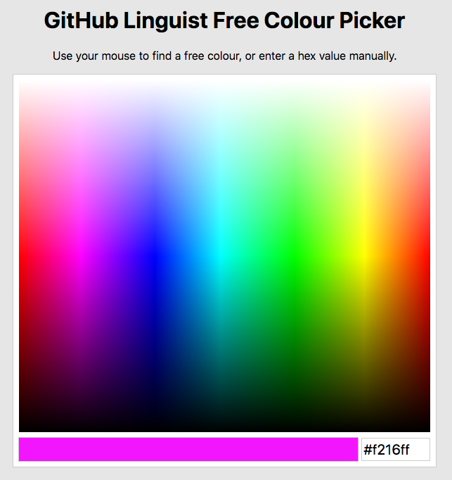

# GitHub Linguist Free Colour Picker

This is a simple web page that can be used to find free colours for use with [GitHub Linguist](https://github.com/github/linguist) and can be seen in action at <https://lildude.github.io/linguist-free-colours/>.

Why would you want such a tool? Linguist currently enforces a proximity rule to ensure two colours associated with two different languages are not too similar to be virtually imperceptable.
Trying to find another colour when your chosen colour isn't available is a tedious process of trial and error and running the test over and over again until it's finally happy.
Not anymore! 🎉
This tool does it for you, and looks pretty too 😉.

## Components

I've tried to keep this as simple as possible without reinvesting the wheel where possible, so I've kept dependencies to a minimum.

- [js-yaml](https://github.com/nodeca/js-yaml) is used to parse the `languages.yml` file, and
- <https://github.com/hamada147/IsThisColourSimilar> is used to calculate DeltaE00 as used by the colour proximity test.
